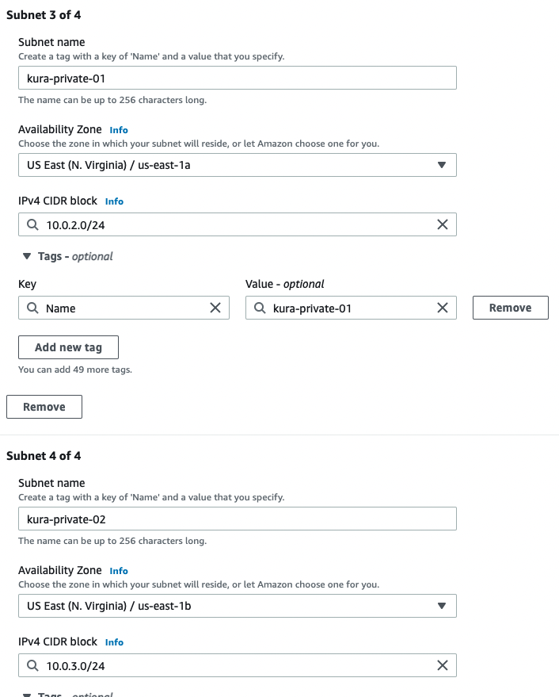

# AWS-VPC-3TIER Documentation

## Purpose:

The purpose of this project is to create a classic 3 tier architecture within our own virtual private cloud(VPC) hosted by AWS. 

This 3 tier architecture will consist of an nginx reverse proxy which will retrieve traffic, this proxy will then redirect traffic to our server application hosting Phpmyadmin, which will then communicate with MySQL database hosted by AWS. 

## Steps to replicate:

### Creating a VPC in AWS

1. Create a new VPC through the AWS console with the following configurations:
- Name: Kura-3-Tier
- CIDR Block: 10.0.0.0/16 (This will provide you with a range of ip address your VPC can use)
- IpV6 Block: None
- Tenency: Default

### Creating Private and Public Subnets

1. First up we are going to create public subnets which will host our Nginx reverse proxy. This is set up in our public subnet to allow for clients to actually connect to it. After that we will create a private subnet for our databases and the server hosting our actual application.  

2. Navigate to the subnets tab in the VPC section of AWS and lick create subnets.

3. Choose the VPC you recently just created, and configure the 4 following subnets. 

    

    

4. You will notice we created a total of 4 subnets across 2 different availability zones, the reason for this is because some AWS services require it also introduces resiliency and redundancy to our system. This is good for systems stressed by load or if one AZ were to go down. 

#### Attaching an Internet Gateway to our VPC

1. Navigate to the Internet gateway tab in AWS and create a new Internet Gateway (IG)

2. I named my IG Kura-IG for consistency, once this IG is created attached it to your VPC. (This might take a bit to update)

#### Create a NAT gateway to allow for outbound internet access for your private subnet. 

1. Navigate to the 

#### Set up route tables:

1. 